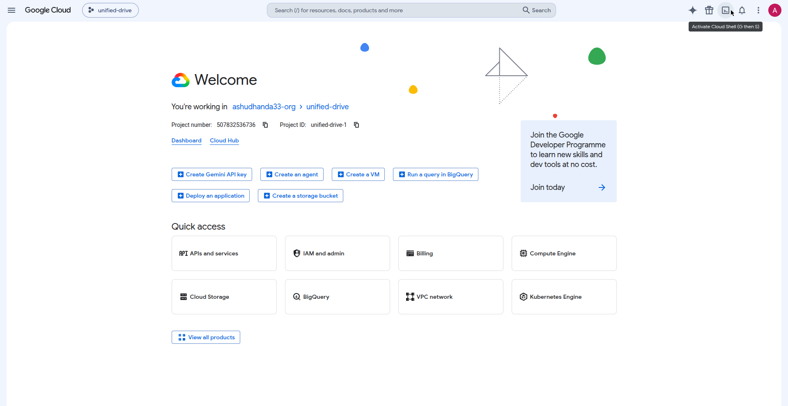
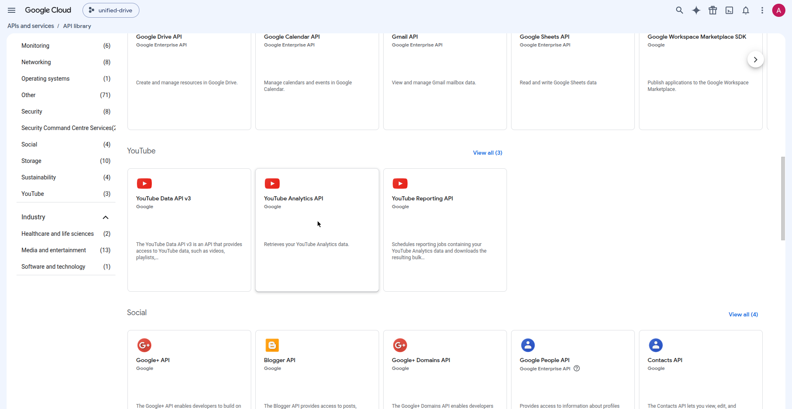
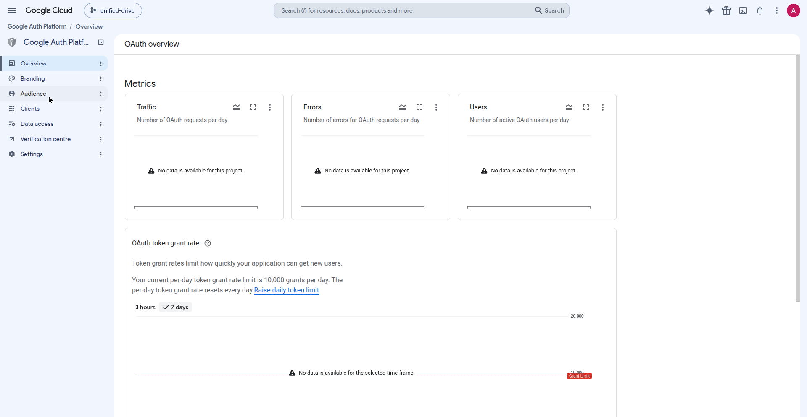
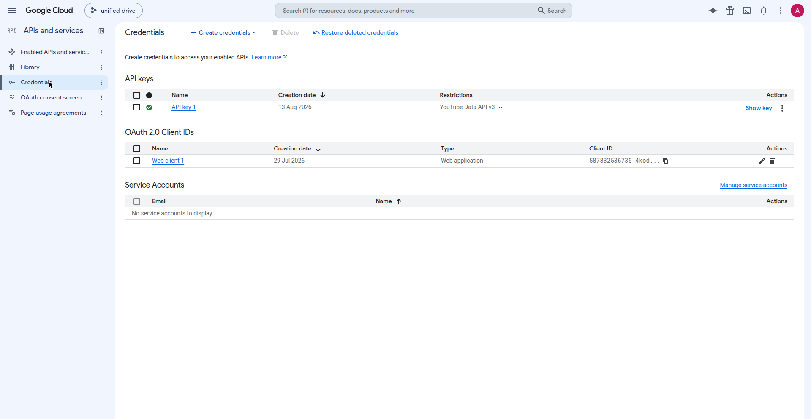

# Connect YouTube to ClipForge2 — do this once (≈5 minutes)

ClipForge2 can upload your Shorts straight to YouTube by itself. For that,
**you** need to do a one-time setup in your own Google account (I can't do
this part for you — it's your account, your clicks). No coding, just clicking.

## What you'll end up with

- YouTube uploads happen from a button in the ClipForge2 dashboard.
- Free quota: **100 uploads per day** (YouTube's limit for new apps, Pacific-time
  day). The dashboard shows how many you've used today.
- While your Google Cloud app is unverified (normal for personal use), uploads
  are **private-only** — you can flip them public in YouTube Studio yourself.
- If the quota runs out, the dashboard tells you and you can still upload
  manually through YouTube Studio (no quota needed there).

---

## Step 1 — Create a Google Cloud project (2 min)

1. Go to **https://console.cloud.google.com** and sign in with the Google
   account that owns your YouTube channel.
2. At the top, click the project dropdown (it may say "Select a project")
   → **New Project**.
3. Name it `ClipForge2` (any name works) → **Create**. Wait for it to finish,
   then make sure it's selected in the dropdown.

   

## Step 2 — Turn on the YouTube Data API (1 min)

1. In the left menu, go to **APIs & Services → Library**.
2. Search for **YouTube Data API v3** → click it → **Enable**.

   

## Step 3 — Set up the consent screen (1 min)

1. In the left menu, go to **Google Auth Platform → OAuth consent screen**
   (in older console versions: **APIs & Services → OAuth consent screen**).
2. Choose **External** → **Create**.
3. Fill in:
   - App name: `ClipForge2`
   - User support email: your email
   - Developer contact email: your email
4. Click **Save and Continue** through Scopes and Test users (you can skip
   both for now — but see the note in Step 5).

   
5. On the Summary page click **Back to Dashboard**.

## Step 4 — Create the login credentials (1 min)

1. Go to **APIs & Services → Credentials**.
2. Click **+ Create Credentials → OAuth client ID**.
3. Application type: **Desktop app**. Name it `ClipForge2 Desktop`.
4. Click **Create** → **Download JSON** (the ⬇ button on the right). Keep
   that file somewhere you can find it — e.g. your Downloads folder.
   (Don't open it, don't share it, don't post it anywhere.)

   

   > ⚠️ **Open-source safety:** ClipForge2's code is public on GitHub. The
   > `youtube_client.json` (and the `youtube_token.json` created at connect
   > time) must **never** be copied into the repo folder — the dashboard
   > stores them in your private app folder only. The repo's `.gitignore`
   > blocks them from being committed even by accident.

## Step 5 — Connect inside ClipForge2 (1 minute)

1. Open the ClipForge2 dashboard (it opens by itself when you run the app).
2. At the top you'll see the YouTube setup box. Click **Choose file**,
   select the JSON you downloaded in Step 4, then click
   **📤 Upload client JSON**.
3. Now click **🔗 Connect YouTube**.
4. Your browser opens a Google sign-in page:
   - Pick the Google account that owns your YouTube channel.
   - Google may warn **"Google hasn't verified this app"** — that's normal,
     it's *your own* app. Click **Advanced → Go to ClipForge2 (unsafe)**.
   - Tick the box for **"Upload YouTube videos"** (that's all we ever ask
     for — we can't read your emails or anything else) → **Continue**.
4. The dashboard now shows **Connected ✅** with today's upload quota.

> **Note:** while your app is in "Testing" mode (Step 3), Google only lets
> *test users* sign in. If sign-in is blocked, go back to
> **OAuth consent screen → Test users → Add users** and add your own email.

## Step 6 — How uploads work now

| Your mode | What happens |
|---|---|
| **Manual** | Nothing changes — download clips, upload yourself. No login needed. |
| **Semi-auto** | Each clip card gets an **⬆ Upload** button — one click uploads it. |
| **Full autopilot** | Finished clips upload automatically, stopping politely at the daily quota. |

## Good to know

- The login token is stored only on your computer
  (`~/.clipforge2/youtube_token.json`) and refreshes itself silently —
  you approve **once**, never again.
- **Disconnect** anytime with the Disconnect button in the dashboard.
- ClipForge2 never sees your Google password and never uploads anything
  you didn't approve (except autopilot mode, which you switched on yourself).
- Quota resets at **midnight Pacific Time** (that's YouTube's rule, not ours).
